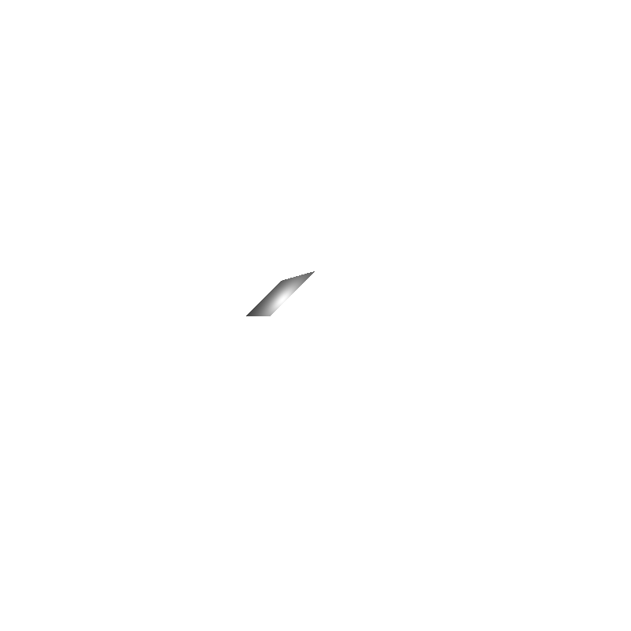

# Lab2 of CG -- CONG YU

## Environment

OS: Mac OS

Compiler: Apple clang version 11.0.3 (clang-1103.0.32.29)

## P1 ray tracing

The basic idea is that first calculate the intersection of ray and the plane which the parallelogram exists and check whether that intersect is in the parallelogram. 

The tricky part is that the direction of the normal should be checked with ray direction.

The difference between orthographic and perspective is that the former will keep the shape while the latter does not.

##

Orthographic

## 

Perspective

## P2 Shading

We can see the shading effects vary with specular parameter p.

When p is small the sphere is brighter. And when p grows greater, the sphere is becoming darker but more shiny and grossy.

p = 1

p = 100

p = 1000

p = 10000

