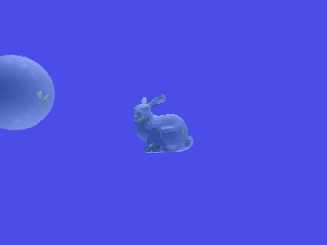
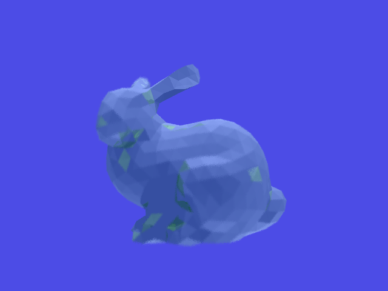
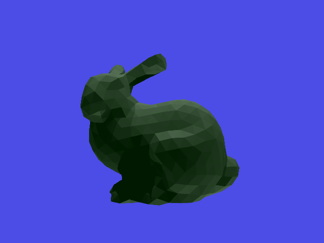
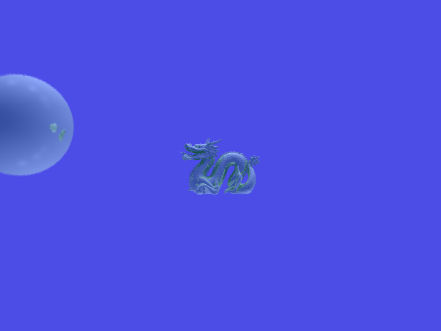
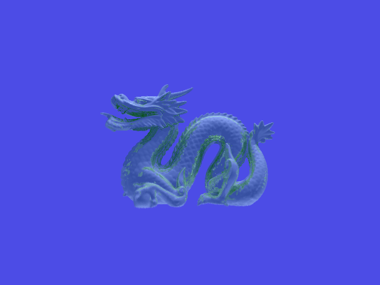

#Result

Bunny

This bunny looks blurry because LensRadius is set as 0.08, if we shrink it to 0.008, then it looks clearer as the dragon rendered below.

Dragon

# Finding

1. BVH can boost rendering drastically
2. Everytime AABB split space, better change axis in turn. (Fix axis brings longer running time)

